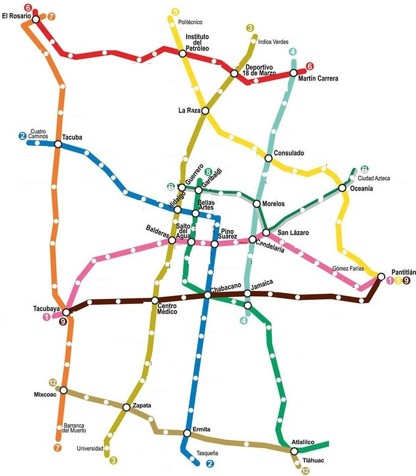
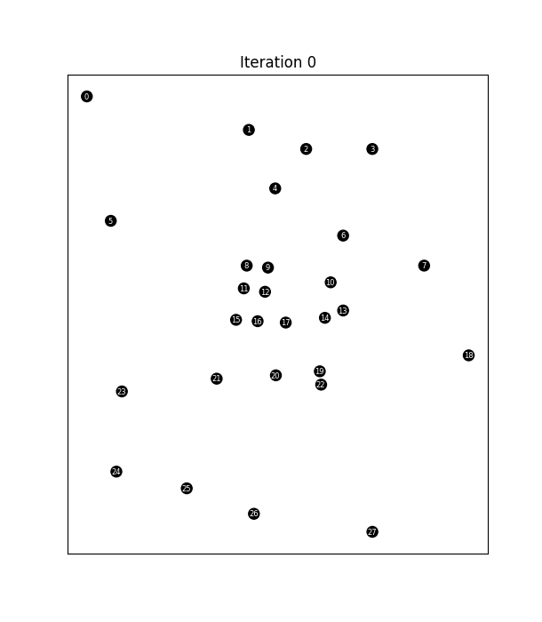

# A Genetic Approach to the Shortest Path Problem: CDMX metro network


I present an implementation of a **Genetic Algorithm (GA)** to solve the shortest path problem within the Mexico City Metro network. The project models the transit system as a graph and uses evolutionary heuristics to find optimal routes between stations.



## Overview
The shortest path problem is a fundamental challenge in graph theory and logistics. While deterministic algorithms like Dijkstra's provide exact solutions, this project explores the effectiveness of **Evolutionary Computation** in a real-world urban transit context. By treating sequences of stations as chromosomes, the algorithm iteratively refines a population of paths to minimize total travel cost.

## Problem Formulation
The Mexico City metro system is represented as a graph $G = (V, E)$, where $V$ represents the set of metro stations and $E$ represents the physical connections between them.

### Data Extraction & Graph Construction
To build the graph, coordinates for the stations were extracted through an image-processing approach:
* **Nodes**: Relevant metro stations (transfer points and terminal stations) were identified and mapped to a coordinate system from the image [plano-red-metro-cdmx.jpg](assets/plano-red-metro-cdmx.jpg).
* **Edges**: The connectivity was represented using a Sparse Matrix (`csr_matrix`) to efficiently handle the network topology and was manually defined.
* **Weights**: Distances between nodes were approximated by computing the euclidean distance between such points to serve as part of the cost function.

## Methodology
The Genetic Algorithm implementation follows these key evolutionary phases:

1.  **Initial Population**: A set of candidate paths (sequences of nodes) is generated randomly. See the ``generate_pah`` function to fully understand this process in [MetroCDMX.ipynb](MetroCDMX.ipynb).

2.  **Fitness Evaluation**: The fitness function measures the "quality" of a path. The goal is to minimize the total distance while heavily penalizing invalid transitions (non-existent edges).

    Let $v_1, v_2 \in V$ such that $P: v_1 = v^1 \rightarrow \cdots \rightarrow v^n = v_2$ is a simple path between $v_1$ and $v_2$. We define the distance of the path $P$ as follows:
    $$d(P) = \sum_{j=1}^n w(v^j, v^{j+1})$$

    where $w(v^j, v^{j+1})$ represnts the weight from the edge $\{v^j, v^{j+1}\}\in E$.

    With this, we define the **fitness function** $f$ of $P$ as
    $$f(P) = \frac{1}{d(P)}$$

    In our context, any simple path $P$ from "El Rosario" ($v_0$) to "San Lázaro" ($v_{13}$) will be considered a "genome".

3.  **Selection & Crossover**: Parents are selected based on fitness to produce offspring, combining sub-paths from successful "ancestors" to explore new routing possibilities. The hardest part in this project is to ensure that modifications of the current genomes leave a new **valid** genome. 

    Let $P_1:a=v^1\rightarrow\cdots→ v^n=b$ and $P_2:a=u^1\rightarrow\cdots→ u^m=b$ be two simple paths from $a$ to $b$. To breed $P_1$ and $P_2$ we will procede as follows

    **Case 1**

    Suppose that $P_1\cap P_2\neq\emptyset$ then, $\forall\ \mu\in P_1\cap P_2$, $\exists\  v^i\in P_1,u^j\in P_2$ such that $\mu=v^i=u^j$.

    If $v^1\rightarrow\cdots\rightarrow v^{i-1}\cap u^{j+1}\rightarrow\cdots\rightarrow u^{m}\neq\emptyset$ we **breed** $P_1$ and $P_2$ to create a new simple path $P_3$ given by
    $$P(\mu):v^1\rightarrow\cdots\rightarrow v^{i-1}\rightarrow \mu →v^{j+1}\rightarrow\cdots\rightarrow u^{m}$$
    which is a valid genome because none of the vertices at the right appears at the left and it starts and ends at the same places.

    If the former is not true, we skip such $\mu$ and pass to the next one (if exists).

    Suppose that this process is valid for some $\mu_1,\dots\mu_k\in P_1\cap P_2$, so we form childs $P(\mu_1),\dots,P(\mu_k)$. Now, in the sake of omptimality, we return the path $P(\mu_s)$ that maximices the fitness function value.

    **Case 2**

    Suppose that $P_1\cap P_2=\emptyset$ or Case 1 is false for all $\mu\in P_1\cap P_2$ then we say that $P_1$ and $P_2$ are **not breedable** and simply return one of both at random.

4.  **Mutation**: Random variations are introduced to the paths to maintain genetic diversity and prevent the population from stagnating in local optima.

    Let $P:a=v^1→⋯→v^n=b$ be a simple path from $a$ to $b$. Now, with probability $p$ select some random vertex $v^i\in P-\{a,b\}$ and define $P^{(i)} = v^1→⋯→ v^{i-1}\subset P$ as the $i$-th cut of $P$. Now, we run the ```generate_path``` procedure with parameters $v^i,v^n,P^{(i)}$ and return the result.

    Note that there exists at least one path that connects $v^i$ to $b$ without passing by the former nodes, which is $v^{i}\rightarrow\cdots\rightarrow v^{n}$ itself. Hence, this process will always return a valid genome.

## Results
The algorithm demonstrates strong convergence characteristics. Analysis of the optimization process shows:
* **Convergence**: The "Best path fitness per iteration" typically stabilizes within a few generations.
* **Performance**: Empirical results indicate that the mean fitness value after the 6th iteration is closer than or as good as **90.0%** of the value achieved by the global optimum.

